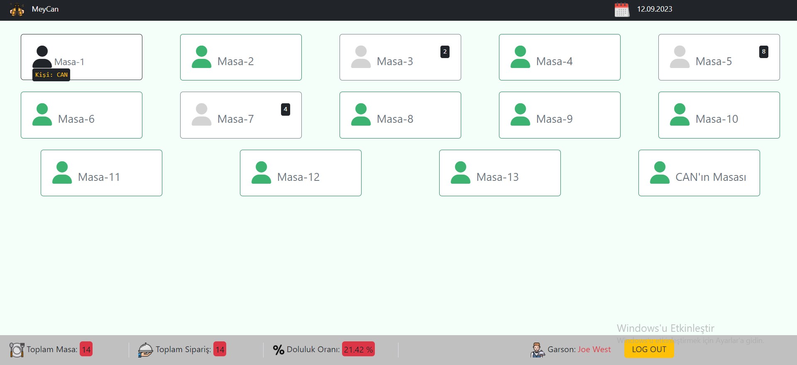
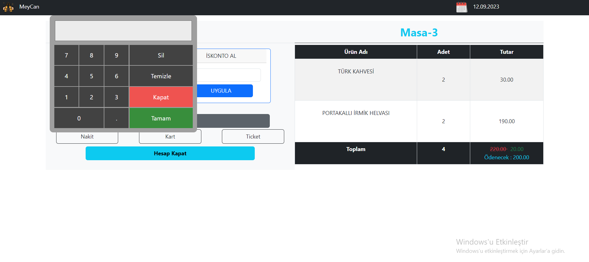
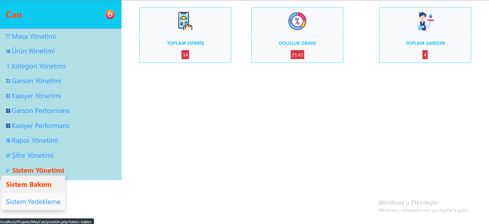

# Restaurant_App
> 1. Giriş Sayfası
>> 
>> Seçilen butona göre sayfa yönlendirmesi yapılıyor
> 2. Garson Sayfası
>> 
>> 
>> Garson rezervasyon yapma-kaldırma işlemi yapabilir. Masaya ürün ekleyebilir. Ürünleri silebilir. Masa birleştirme ve değiştirme yapabilir. Adisyon alır.
> 3. Kasiyer Sayfası
>> 
>> 
>> Kasiyer masaların hesap işlemlerini yapar. İskonto alma veya parça hesap alma işlemi uygulayabilir.
> 4. Yönetici Sayfası
>> 
>> 
>> Yönetici masa-ürün-kategori gibi tüm başlıklar için ekleme silme ve güncelleme yapabilir. Garson ve kasiyer performanslarının excel raporunu alabilir. Şifre işlemleri yapabilir. Sistem bakım ve yedeklemesini yapabilir.